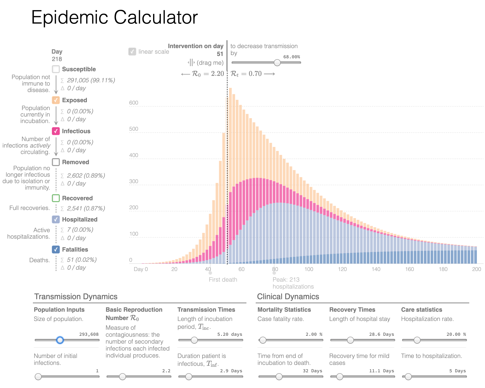

# Modeling COVID

(Prof. Dr. Gerd Graßhoff, Faculty of Philosophy)

In order to illustrate the impact of the corona pandemic for the Humboldt University subpopulation, I set the parameters for a SEIR disease model, programmed by Gabriel Goh: The university population comprises (even more) than 300 000 persons in close contact. They include students, staff, administration, their close families. To make the temporal scales easy to read, we assume February 1 2020, as day 0 for the first infection. The temporal progression of the numbers can be estimated by adding a mean month of 30 days (e.g. April 1 = day 60, May 1 = 90, June 1 = day 120, July 1 = day 150).

[My parameters for SEIR model by Gabriel Goh](http://gabgoh.github.io/COVID/?CFR=0.02&D_hospital_lag=5&D_incbation=5.2&D_infectious=2.9&D_recovery_mild=11.1&D_recovery_severe=28.6&I0=1&InterventionAmt=0.33333333333333337&InterventionTime=50.666666666666664&P_SEVERE=0.2&R0=2.2&Time_to_death=32&logN=15.761420707019587)

The model assumes an initial epidemiological dissemination with a basic reproduction number R0 = 2.0 as a key measure for the degree of infection. At day 50 (3rd week of March) an intervention with social distancing reduces the basic infection rate to R0=0.7. Soon after the intervention the total number of diagnosed infected persons will decrease, while the number of infectious people peaks around day 75, hospitalized people day 80.

For the summer semester the beginning of adjusted teaching at 20th April just before the modeled peak the epidemic with a high rate of endangered population well into the summer.
